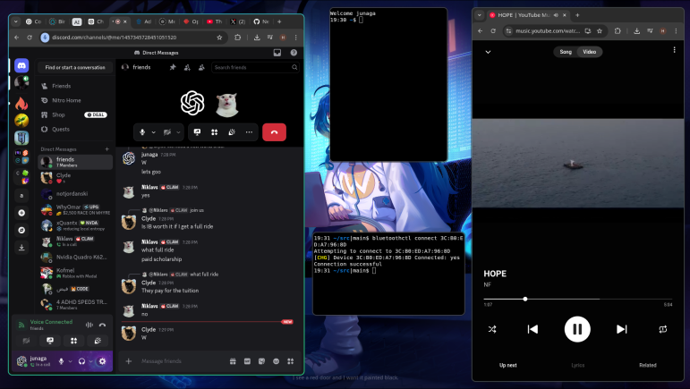

# Desktop

## NVIDIA GPU, [hypr.land](https://hypr.land) and Google Chrome

Run these commands from the repository root.

```sh
bash ./base/upgrade.sh
cp -ra ./base/home/. /root/.

bash ./desktop/format.sh
bash ./desktop/install.sh hypr

reboot 0
```

```sh
# From the root VT:
exec desktop
```


