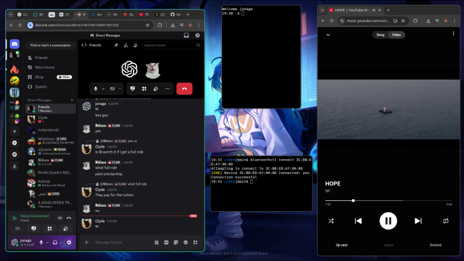

- [github.com/microsoft/WSL](https://github.com/microsoft/WSL)
- [github.com/apple/container](https://github.com/apple/container)
- [github.com/pbatard/rufus](https://github.com/pbatard/rufus)

# Debian `14` [//debian.org](https://debian.org/)

I use the Debian operating system almost everywhere, [with](https://www.reddit.com/r/unixporn/top/?t=year) and [without](<https://en.wikipedia.org/wiki/Terminal_emulator>) a graphical interface,

- with public cloud providers
- in Microsoft Windows
- on `x86-64` devices _64-Bit-Wintel-IBM-PC_

## Installation

1. **Host, Server, Container**: Rent, Subscribe, Deploy: "Debian"
2. **Windows 10 or 11**: [`wsl.exe --install`](./win/linux/README.MD) `debian`
3. **Laptop or Desktop**: i use [rufus](https://github.com/pbatard/rufus). it's hard ask ChatGPT for help

```sh
uname # >Linux
hostnamectl # >Debian
```

## Initialization

Copy & Paste code manually, or download files with `git clone`, `curl`, `wget`.

In 1983 Apple invented `C` for copy, `V` for paste, `X` for cut, `Z` for undo. Windows _19-_ 95 added similar keys. The original IBM PC clipboard keys remain supported on Windows.

| System                                 | **Copy**       | **Paste**      | **Cut**        |
| -------------------------------------- | -------------- | -------------- | -------------- |
| **macOS**                              | `CMD+C`        | `CMD+V`        | `CMD+X`        |
| **Windows & Linux**                    | `CTRL+Insert`  | `Shift+Insert` | `Shift+Delete` |
| **Windows & Linux: Desktop**           | `CTRL+C`       | `CTRL+V`       | `CTRL+X`       |
| **Windows & Linux: Terminal Emulator** | `CTRL+Shift+C` | `CTRL+Shift+V` |                |

## Configuration

do anything you like, no really. ask ChatGPT for help. here is what I usually do.

### packages

```sh
sudo bash debian/script/upgrade.sh
```

### dotfiles

with an `$EDITOR` like [VS Code](https://code.visualstudio.com/) you can manually configure dotfiles (`code ~/`).

```sh
cp -r debian/home/. ~/.
code ~/.env # or micro, nano, vim,
exit # and enter
```

### NVIDIA GPU, [hypr.land](https://hypr.land) and Google Chrome



1. Install minimal Debian (CLI only).
2. disable "Secure Boot" in UEFI for DKMS for NVIDIA

```sh
sudo apt modernize-sources --yes
sudo $EDITOR /etc/apt/sources.list.d/debian.sources
# edit: Components: main contrib non-free non-free-firmware
sudo apt update

sudo bash debian/script/install.sh
sudo reboot 0
```

```sh
# run
dbus-run-session Hyprland --config ~/.hypr

# up system, desktop, browser
sudo apt upgrade --yes

# ls GPU processes
nvidia-smi
```

### move home directory

```sh
sudo chown -R $USER:$USER /usr/local/
cp -r /home/$USER/. /usr/local/.

sudo sed -i "s|/home/$USER|/usr/local|" /etc/passwd
sudo sed -i "s|/root|/tmp|" /etc/passwd
exit # and enter
sudo rm -fr /home/ /root/

cd ~/
sudo bash debian/script/autoremove.sh
```
