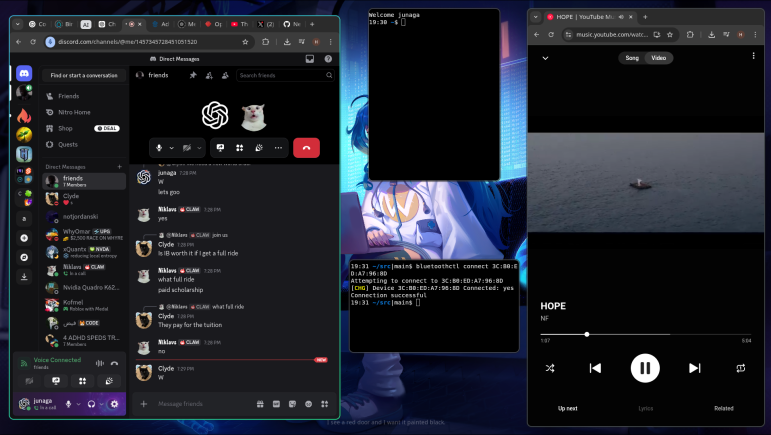

```sh
uname # Linux
hostnamectl # Debian
```

# Debian [//debian.org](https://debian.org/)

We use the Debian operating system almost everywhere. [With](https://www.reddit.com/r/unixporn/top/?t=year) and [without](https://en.wikipedia.org/wiki/Terminal_emulator) GUIs.

## Installation

### Windows - _Recommended_

On Windows 11 or Windows 10 use the [Windows subsystem for Linux](./windows/readme.md).

```sh
wsl.exe --install debian
```

### Cloud

Sign up [anywhere in the cloud](https://getdeploying.com/reference/compute-prices) with a debit;credit card, then rent;subscribe;provision a host;server;container with any `Debian` release. I rent on [console.hetzner.com](https://console.hetzner.com/); Server with 2 vCPUs with block storage. ID required for sign up. A server is just a computer without monitor or keyboard. Use SSH for Terminal and FTP connections.

### Hardware - _Complicated_

For Desktop;Laptop;`x86-64` devices _64-Bit-Wintel-IBM-PC_ you can [create a bootable USB drive](./desktop/install/readme.md). Boot UEFI, then boot the USB, then install a system to your M.2;SSD;HDD drive, then boot that drive. You can also boot from microSD, network, or memory. Just ask ChatGPT for help.

## Initialization

Copy & Paste; or download files with `git clone`, `curl`, `wget`.

|                                   | **Copy**       | **Paste**      | **Cut**        |
| --------------------------------- | -------------- | -------------- | -------------- |
| **macOS**                         | `CMD+C`        | `CMD+V`        | `CMD+X`        |
| **Windows & Linux**               | `CTRL+Insert`  | `Shift+Insert` | `Shift+Delete` |
| **Windows & Linux: Desktop**      | `CTRL+C`       | `CTRL+V`       | `CTRL+X`       |
| **Windows & Linux: Terminal App** | `CTRL+Shift+C` | `CTRL+Shift+V` |                |

In 1983 Apple invented `C` for copy, `V` for paste, `X` for cut, `Z` for undo. Windows _19-_ 95 added similar keys; but The IBM PC keys still work. Without a Desktop `CTRL+C` sends byte `3` which is `"End of Text"` in [ASCII and Unicode](https://en.wikipedia.org/wiki/C0_and_C1_control_codes).

## Configuration

Install packages and connect [ChatGPT](https://chatgpt.com/)

```sh
sudo bash ./node/upgrade.sh
bash ./agent/install.sh ~/bot/

openclaw tui
```

Configure Shell and generate new SSH keypair

```sh
cp -r ./node/home/. ~/.

bash

LABEL="hermann@stanew.name"
ssh-keygen -C $LABEL -N ""
cat ~/.ssh/id_ed25519.pub # public key

ssh brigade
```

Use an Editor like [VS Code](https://code.visualstudio.com/)

```sh
code ~/.bash_history # or notepad.exe, cursor, micro, nano, vim

bash ./desktop/editor/extensions.sh
# copy ./desktop/editor/settings.json
# copy ./desktop/editor/keybinds.json
```

### NVIDIA GPU, [hypr.land](https://hypr.land) and Google Chrome

Make sure you manually disable `Secure Boot` in `UEFI`; Because `apt:nvidia-driver` is not installed, it's compiled with `apt:dkms`. Installing `apt:nvidia-driver` installs the source code, then it compiles, then installs the actual driver software. But the newly compiled software has no cryptographic release signature, which is required for `Secure Boot`.

```sh
sudo bash ./node/upgrade.sh
sudo bash ./desktop/upgrade.sh
cp ./desktop/.hypr ~/.hypr
sudo reboot 0
```

```sh
dbus-run-session Hyprland --config ~/.hypr
```


