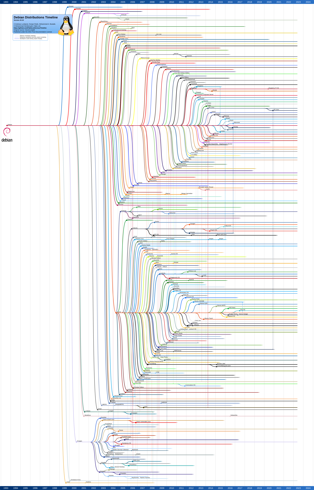

@Fireship has a great [10 minute video](https://www.youtube.com/watch?v=ShcR4Zfc6Dw) about Linux.

# Why Debian [//debian.org](https://debian.org/)

The "Universal Operating System" Debian is the worlds vanilla (meaning default) Linux distribution.

## 5 Reasons to use Debian

### 1. Not Windows

It's almost impossible to develop apps in Windows userspace.

- macOS, BSD, and most Linux are Unix systems, Windows is not
- kinda like the web, Windows is a _giant mess_
- Windows is required for gaming, but Linux is for programming

### 2. Huge but lightweight

Every traditional computer program is a single `apt install` command away from operation.

- [distribution of 65000 packages](https://packages.debian.org/stable/) `docker.io` `nodejs` `sshfs` ...
- [runs everywhere](https://www.debian.org/ports/) `ARM` `x86` `x86-64` ...
- [recommended minimum system requirements](https://www.debian.org/releases/stable/amd64/ch03s04.en.html) are 4GB storage and 0.5GB memory

A fresh install has 200 packages totalling 0.5GB storage (with docs and i18n).

### 3. A Server System

Debian the "Universal Operating System" is good for embedded, client, and server computers.

You can run a VPS in the public cloud, gameservers like Minecraft, or backend containers. Most servers on the web are Debian based Linux computers.

There is no Arch Linux runner for any [CI server](https://github.com/ligurio/awesome-ci), to build-test-deploy an app. Arch Linux is for workstations not for servers. Similarly, while NixOS can do everything in theory, most production web servers are either Debian/Ubuntu Linux or BSD systems. The Nix language is mostly used by PC modders, [containers](https://opencontainers.org/) + scripts are the industry default.

### 4. Stable

With a test-release cycle of 24 months, Debian never has fresh software, but the packages you do get, are secure and stable on their own, and with each other. If you do need the latest/beta/testing/unstable version of something, install it manually and document or script the process. Instead of trying to discover the perfect house, grow your own garden.

The arguably best thing about Debian, is that it is boring, without any quirks. It's the tool for the job.

### 5. Freedom

Like all open source software, it costs $0

Debian is **free as in freedom** open source software (FOSS), that is [copyleft](https://en.wikipedia.org/wiki/Copyleft) (GPL) licensed. Developed by thousands of volunteers from all over the world, with the exception of `non-free-firmware`, Debian is free for anyone, to use, modify, and redistribute. A lot of [Linux distros](https://en.wikipedia.org/wiki/List_of_Linux_distributions) redistribute Debian, like Ubuntu, Tails, Raspberry Pi OS.

