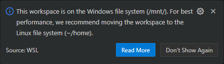

# Windows Subsystem for Linux [//microsoft.com](https://learn.microsoft.com/windows/wsl/)

The **Windows Subsystem for Linux version 2** `wsl.exe` is a virtual machine that can run any [Linux distribution](https://en.wikipedia.org/wiki/List_of_Linux_distributions) with all Linux software. To run `wsl.exe` you need,

- a modern [x86-64 CPU](https://en.wikipedia.org/wiki/X86-64) (which has [x86 virtualization](https://en.wikipedia.org/wiki/X86_virtualization))
- Windows 10, Windows 11, or later
- installed Windows Updates `ms-settings:windowsupdate`

_Intel and AMD CPUs manufactured after ~2010 have x86 virtualization._

_You need to move your project or work files **inside Linux**, else Linux software will run slowly._



_Enabling x86 virtualization can cause performance issues in Unreal Engine 5 based video games on windows 10. (discord.com @niklavs said this, but without a source)_

## 1. Enable x86 virtualization

This process is different depending on CPU, motherboard, and firmware. I highly recommend to do this unique process for your personal computer with [chat.com](https://chat.com/).

```cmd
REM open cmd.exe
REM is x86 virtualzation enabled?

systeminfo.exe | find "Virtualization"
REM > Virtualization-based security: Status: Running Base Virtualization Support
```

### `UEFI` + ASUS motherboard + AMD CPU


### `UEFI` + ASUS motherboard + Intel CPU


_yes, some motherboard vendors call `UEFI` firmware `BIOS`. so people who used `BIOS` firmware, in ~2015 or before, don't become scared._

_Windows 11 officially doesn't support `BIOS` booting (`BIOS` can't run TPM)._

## 2. Enable WSL

1. **Windows Settings** > **System > Optional features** `ms-settings:optionalfeatures`
3. Click **More Windows features** `optionalfeatures`
2. Check **Virtual Machine Platform** and **Windows Subsystem for Linux**
3. Click OK and reboot


```cmd
REM open cmd.exe
REM is wsl.exe installed?

wsl.exe --version
REM WSL version: 2
REM WSLg
```

_Very rarely it can happen that a Windows update disables a Windows features, they need to be manually enabled again._

## 3. Install Linux

```cmd
REM open cmd.exe

REM install Ubuntu Linux
wsl.exe --install

REM list distros in the Microsoft Store
wsl.exe --list --online

REM install a distro
wsl.exe --install Ubuntu
```

Every system needs a user. For `username` you could use your [github.com](https://github.com) username and for `password` you could use `1`.

```cmd
REM enter username
REM enter password
REM enter password
```

## Done

That's it, make sure to RTFM and happy hacking!

- create, read, update, delete Unix files
- use `bash` and run `.sh` scripts
- install and run any Linux program
- run any server, database, container ...
- ssh, git, docker ... just work
- **run Windows programs on Unix files!**

## How does it work?

WSL 2 utilizes a lightweight Hyper-V virtual machine to run a real Linux kernel. Linux kernel updates are distributed via Windows Update.

WSL integrates with Windows for file access, networking, and IPC.

```bash
# Windows Drives are mounted Linux directories
ls -a /mnt
ls -a $(wslpath 'C:\Users\')

# Linux software runs on Windows files
paplay /mnt/c/$USER/Downloads/meow.mp3

# Linux roots are mounted back into Windows
explorer.exe '\\wsl.localhost\'
explorer.exe $(wslpath -w $HOME)

# Windows apps run with Linux files!
explorer.exe .
echo $PATH # > /mnt/c/**

# Linux<>Windows glue and drivers
ls /usr/lib/wsl/
```

The root filesystem is stored in `%LOCALAPPDATA%\wsl\<distro>\ext4.vhdx`.
