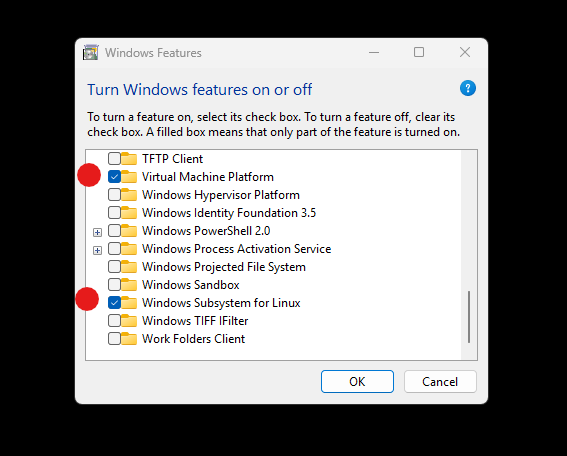

# Windows Subsystem for Linux [//microsoft.com](https://learn.microsoft.com/windows/wsl/)

The **Windows Subsystem for Linux version 2** `wsl.exe` is a virtual machine that can run any [Linux distribution](https://en.wikipedia.org/wiki/List_of_Linux_distributions). To run `wsl.exe` you need,

- a modern [x86-64 CPU](https://en.wikipedia.org/wiki/X86-64) (which has [x86 virtualization](https://en.wikipedia.org/wiki/X86_virtualization))
- Windows 10, Windows 11, or later
- installed Windows Updates [ms-settings:windowsupdate](ms-settings:windowsupdate)

_Intel and AMD CPUs manufactured after 2010 have x86 virtualization._

## 1. Enable x86 virtualization

Make sure that x86 virtualization is enabled in your computer’s firmware (BIOS or UEFI) settings. This process is different depending on CPU, motherboard, and firmware. I highly recommend to do this with [chat.com](https://chat.com/) for your unique PC.

```bat
REM open cmd.exe

REM check that CPU virtualzation is enabled
systeminfo.exe | find "Virtualization"
REM Virtualization-based security: Status: Running Base Virtualization Support
```

### AMD CPU

1. Reboot and enter UEFI
2. Open **Advanced**
3. Find the **CPU Features** or **SVM Mode** menu
4. Enable **SVM Mode**
5. Save and exit


### Intel CPU

1. Reboot and enter UEFI
2. Open **Advanced**
3. Find the **Intel Virtualization Technology** menu
4. Enable **Virtualization Technology**
5. Save and exit


## 2. Enable WSL

1. Open Windows Settings **System > Optional features:** [ms-settings:optionalfeatures](ms-settings:optionalfeatures)
3. Click **More Windows features**
2. Check **Virtual Machine Platform** and **Windows Subsystem for Linux**
3. Click OK and reboot



```bat
REM open cmd.exe

REM check that wsl.exe is installed
wsl.exe --version
REM WSL version: 2
```

_Very rarely it can happen that a Windows update disables some Windows features, they need to be manually enabled again._

## 3. Installation

Every system needs a user. For `username` you could use your [github.com](https://github.com) username and for `password` you could use `1`. Without a `$DISTRO` `--install` defaults to `Ubuntu` https://apps.microsoft.com/detail/9pdxgncfsczv?hl=en-us.

```bat
REM open cmd.exe

REM list Linux distros in Microsoft Store
wsl.exe --list --online

REM install a distro
wsl.exe --install Ubuntu
REM enter username
REM enter password
REM enter password
```

## Done

That's it, make sure to RTFM and happy hacking!

- create, read, update and delete unix files
- install and run any linux program
- run any server, database, container, etc
- GitOps, DevOps, SSH, etc
- run windows programs on unix files!
