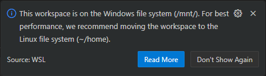
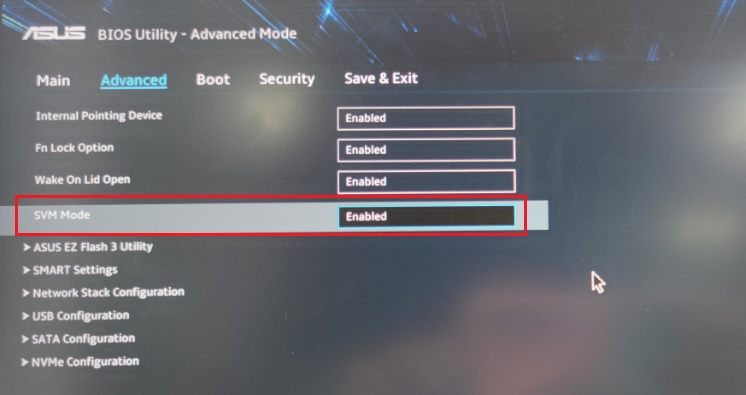
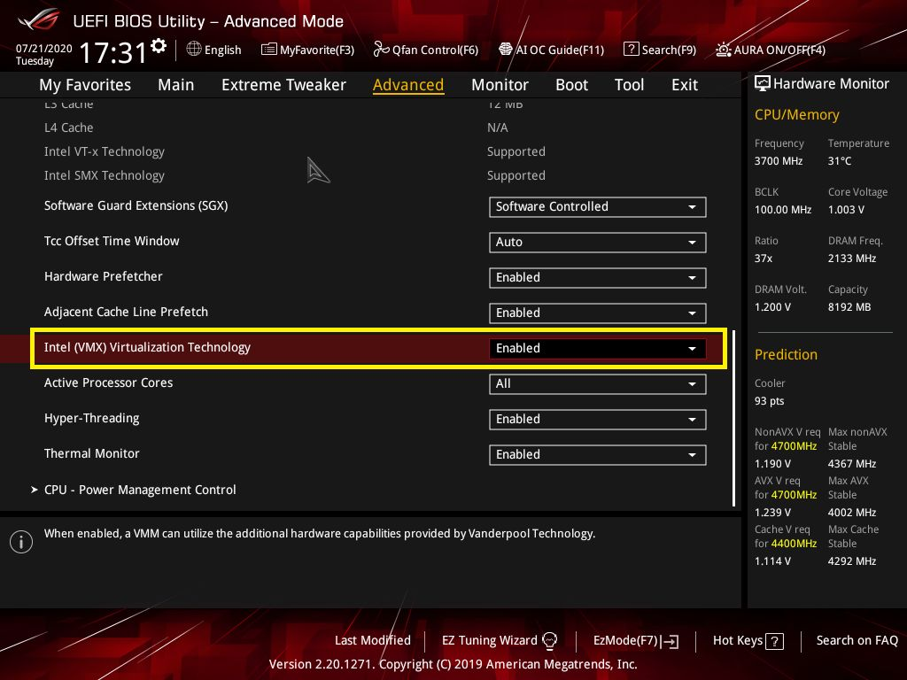
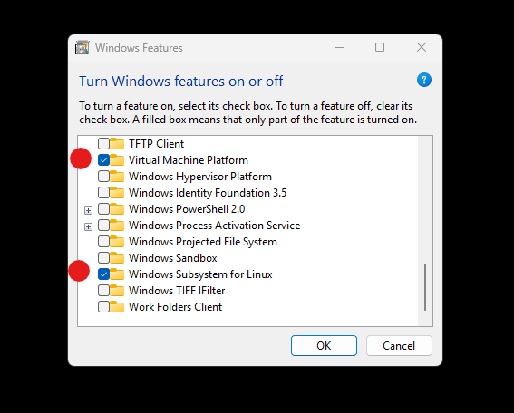
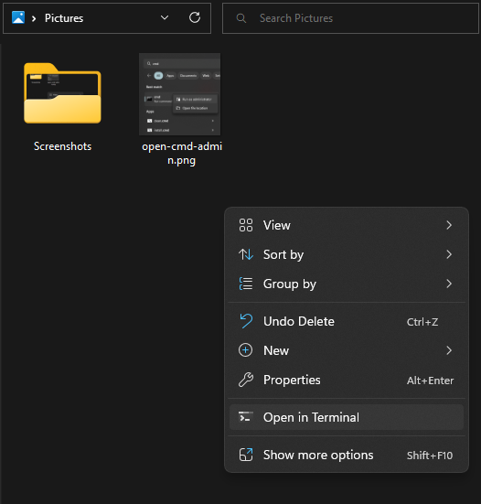

# Windows Subsystem for Linux [//microsoft.com](https://learn.microsoft.com/windows/wsl/)

The **Windows Subsystem for Linux version 2** `wsl.exe` is a virtual machine that can run any [Linux distribution](https://en.wikipedia.org/wiki/List_of_Linux_distributions) and all Linux software. To run `wsl.exe` you need,

- an [x86-64](https://en.wikipedia.org/wiki/X86-64) CPU from 2010 or later (with [x86 virtualization](https://en.wikipedia.org/wiki/X86_virtualization))
- Windows 10, Windows 11, or later
- installed Windows Updates `ms-settings:windowsupdate`

### Debug

_You need to move your project files **inside Linux**, else Linux software will run slowly; because every file operation has to travel between two systems running at the same time._



_Enabling x86 virtualization for Windows 10 can cause performance issues in Unreal Engine 5 based video games. (discord.com @niklavs said this)_

## 1. Enable x86 virtualization

This process is different depending on CPU, motherboard, and firmware. I highly recommend to do this unique process for your personal computer with [chat.com](https://chat.com/).

_Some motherboards still label `UEFI` as `BIOS`. Windows 11 doesn't even support `BIOS`._

### `UEFI` ASUS motherboard AMD CPU



### `UEFI` ASUS motherboard Intel CPU



### Debug

Check if x86 virtualization is enabled

```cmd
systeminfo.exe | find "Virtualization"
REM > Virtualization-based security: Status: Running Base Virtualization Support
```

## 2. Enable WSL

1. **Windows Settings** > **System > Optional features** `ms-settings:optionalfeatures`
3. Click **More Windows features** `optionalfeatures`
2. Check **Virtual Machine Platform** and **Windows Subsystem for Linux**
3. Click OK and reboot



### Debug

Check if WSL is enabled

```cmd
wsl.exe --version
REM WSL version: 2
REM WSLg
```

_Very rarely it can happen that a Windows update disables a Windows feature, they need to be manually enabled again._


## 3. Install Linux

Welcome to the [Terminal](https://www.youtube.com/watch?v=8gw0rXPMMPE);



Install Linux.

_`Ubuntu Stable` updates take 6 months, that's why I recommend `Debian Testing`._

```cmd
wsl.exe --install debian
```

Every system needs a user. For `username` you could use your [github.com](https://github.com) username and for `password` you could use `1`

```cmd
REM enter username
REM enter password
REM enter password
```

## Done

- install and run any Linux program
- use `bash` and run `.sh` scripts
- `ssh`, `git`, `docker` work without Apps
- run any server, database, container ...
- create, read, update, delete Unix files
- **run Windows programs on Unix files!**

## How does it work?

WSL 2 utilizes a lightweight Hyper-V virtual machine to run a real Linux kernel. Linux kernel updates are distributed via Windows Update.

WSL integrates with Windows for file access, networking, and IPC.

```bash
# Windows Drives are mounted Linux directories
ls -a /mnt
ls -a $(wslpath 'C:\Users\')

# Linux software runs on Windows files
paplay /mnt/c/$USER/Downloads/meow.mp3

# Linux roots are mounted back into Windows
explorer.exe '\\wsl.localhost\'
explorer.exe $(wslpath -w $HOME)

# Windows apps run with Linux files!
explorer.exe .
echo $PATH # > /mnt/c/**

# Linux<>Windows glue and drivers
ls /usr/lib/wsl/
```

The root filesystem is stored in `%LOCALAPPDATA%\wsl\<distro>\ext4.vhdx`.
